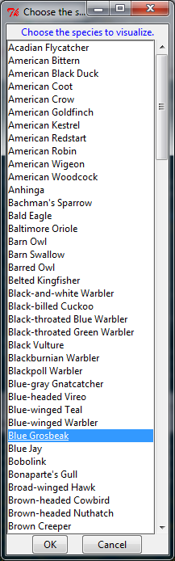

---
output:
#  html_document
  md_document:
    variant: markdown_github
---

```{r, echo = FALSE, message=FALSE}
knitr::opts_chunk$set(
    message=FALSE,
    collapse = TRUE
)

require(geobird)
piedmont <- readRDS("./inst/extdata/piedmont.rds")
```

# The `geobird` package

This package contains functions to read and parse eBird database requests (.txt), store them in a local
SQLite database, and to query that database geographically.  Users may optionally buffer the input geography (usually an `SpatialPolygonsDataFrame` object created from ESRI shapefiles) by any distance.  Additionally, functions are available to visualize the monthly phenology of eBird records by species for a given geography and produce a spreadsheet with eBird records by season.  In the latter, seasonal abundance codes are assigned to each species based on the proportion of complete eBird checklists (i.e., observers reported all species observed), provided some minimum number of checklists is present for a given geography and season.  Current functionality is limited to the United States, but there is little to prevent the expansion of the methods to other areas or georeferenced species occurrence databases.

## Installing geobird

The geobird package requires you to have [R](https://www.r-project.org/) (>= 3.2.1) installed on your computer as well as [Rtools](https://cran.r-project.org/bin/windows/Rtools/).  Both will require administrative priveleges but the installation of packages after this initial install will not.

With R and Rtools installed, install and load the MABM package to access its functionality:

```
install.packages("devtools") # Only the first time
library("devtools")
install_github("adamdsmith/geobirds") # Only the first time
library(geobirds)
```

## Using geobirds

Basic operations are illustrated below.  For details on the arguments and options available in each function, see their associated help files.

### Parsing eBird queries from Cornell

We access historical eBird observations by requesting a state-by-state queries of the eBird database hosted by Cornell.  It comes as an often large (e.g., Florida's weighed in at nearly 4 GB and contained over 10 million records) tab-delimited text file.  We only need a subset of the 43 variables contained in the file and we also like to exclude records (1) not identified to species, (2) duplicated on eBird checklists of multiple observers, and (3) non-approved (i.e., not yet vetted) records.

The `parse_ebird` function accomplishes these tasks and outputs a data structure amenable to local storage in a SQLite database.  One need only direct the function to the appropriate tab-delimited text file.

Take Georgia, for example.  We're left with ~3.3 million statewide eBird records.

```{r parse, eval = FALSE}
ga_birds <- parse_ebird("../Data/ebd_US-GA_relAug-2015.txt") # 1.5 GB; takes ~ 1 min
class(ga_birds)
[1] "data.frame"
dim(ga_birds)
[1] 3351323      12
```

### Storing it locally for quick access

We store this output locally in a SQLite database.  It's a more convenient format for permanent storage and we can query the entire southeastern eBird database geographically and quickly pass the result from the database to R.  Storing the entire database in local memory is not practicable.

The `store_ebird` function does the trick:

```{r store, eval=FALSE}
store_ebird(ga_birds)
```

### Making a geographic query of the database

With the parsed eBird records from all 10 southeastern states stored in the local SQLite database, we can now make a geographic query.  All we need are some polygons defining the areas we wish to query.  In our case, this comes in the form of an ESRI shapefile of southeastern NWRs and fish hatcheries.  

First, we load the shapefile into R:

```{r get_shapefile, eval = FALSE}
SErefuges <- rgdal::readOGR("../GIS", "refuges", verbose = FALSE, stringsAsFactors = FALSE)
```

Now, we have some decisions to make.  Do we want to query all refuges (or a subset) and do we want to extend the area around the boundary (i.e., create a buffer) to capture nearby observations not technically on the refuge?  

Either way, the `geo_bird` function is our friend.

The main arguments we need to worry with are `query_polys` (the polygons we want to query), `buffer` (the distance, in km, we wish to expand our polygon boundary; defaults to 0), and `which_polys` (the identification of specific polygons in `query_polys` if we don't want them all).

For example, we could query the eBird records in all southeastern refuges, with a 2 km buffer around each, using the following command:

```{r all_refuges, eval = FALSE}
all_nwrs <- geo_bird(SErefuges, buffers = 2)
```

However, we'll take the less time-consuming example of using only a single refuge and no buffer (i.e., use the actual NWR boundary).  How does Piedmont National Wildlife Refuge sound?

All we need to specify is the file containing the southeastern refuges polygons and select Piedmont NWR using the `which_polys` argument.  This does require you to know what your polygons are called and to specify the name of the column containing that information, but because we built this around our southeastern NWR shapefile, we get to use the defaults.  Lucky us!  All we need is the name of the refuge; we can toss the formality of calling it a "National Wildlife Refuge" or "National Fish Hatchery."

```{r piedmont, eval=FALSE}
piedmont <- geo_ebird(SErefuges, which_polys = "Piedmont")
```

This leaves us with just over 17,500 eBird records (species observations) in Piedmont NWR.

We could easily have picked only a few refuges as well.  Notice the name is insensitive to capitalization.

```{r a_few, eval=FALSE}
a_few_nwrs <- geo_ebird(SErefuges, which_polys = c("Piedmont", "HOBE SoUnD", "CEDar iSLand"))
```

### Checklists of species abundance and occurrence

The primary goal of this project was to output, for each refuge, a species list for each refuge and some consistent measure of relative abundance and occurrence.  

The `make_checklists` function generates, for each queried polygon, a spreadsheet of all species detected on at least one eBird checklist. For each season (defined below), an estimated abundance classification is provided (defined below) if a minimum number of complete checklists (specified with the `min_lists` argument is available. Regardless, the total number of checklists (complete and incomplete) on which each species was observed in each season is reported. Likewise, the amount of effort (# of complete and total checklists) is reported by season.

We classified seasons as follows: spring (Mar - May), summer (Jun - Aug), fall (Sep - Nov), and winter (Dec - Feb). This classification corresponds roughly to the seasonal bird checklists present in many NWR brochures (which may have had a small part in the decision to use this classification). 

Abundance designations are classified based on the proportion of complete checklists on which a given species occurs. The `min_lists` argument allows the user to determine the number of checklists necessary to even attempt such a designation. The default is 10 complete checklists, although a larger minimum (e.g., 50 or 100) is probably a more reasonable choice for generating an estimate of species relative abundance. Abundance classifications (% of complete checklists) are: Abundant (A; > 50%), Common (C; (30 - 50%]), Uncommon (U; (20 - 30%]), Occasional (O; (10 - 20%]), Rare (R; (1 - 10%]), and Vagrant (V; <= 1%). Notice that the cutoff for a "Vagrant" designation requires at least 100 checklists; with fewer checklists this designation is lumped with "Rare".

Continuing our Piedmont NWR example, the output of the `make_checklists` function is an Excel spreadsheet containing three sheets: (1) seasonal abundance codes for those season with enough complete checklists (all season in this case), (2) seasonal occurrence information giving the total number of checklists (complete and incomplete) reporting a given species, and (3) a summary of the eBird effort on the refuge (seasonal totals of complete and all eBird checklists).

```{r checklist, eval = FALSE}
make_checklists(piedmont)
```

 

### Visualizing records

We can also visualize the monthly patterns of eBird detections by species, relative to eBird effort (i.e., # checklists), using the `plot_ebird_phen` function.

We can specify the species using the `species` argument (using the accepted AOU name but insensitive to capitalization) or, if not specified, we're presented with a list of available species.  We select Blue Grosbeaks, which should be present at Piedmont NWR from spring through fall but largely absent in winter.

```{r phen_plots, eval = FALSE}
plot_ebird_phen(piedmont)
```

 

```{r phen_plots2, echo = FALSE, fig.width = 8, fig.height=5}
plot_ebird_phen(piedmont, species = "Blue Grosbeak")
```

The plot suggests that our expectations were correct, and it also gives us information about the amount of monthly effort which, for Piedmont, is greatest from February through June.  It also reports to us the distance of the buffer around Piedmont that we used --- in this case, no buffer.
