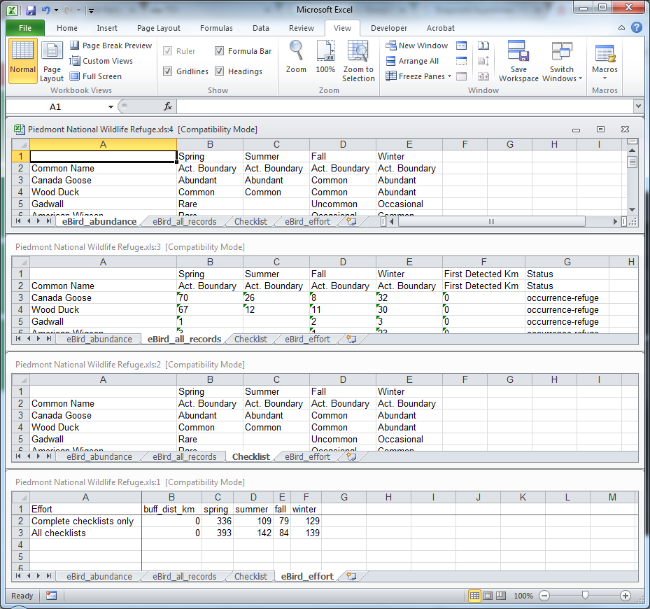
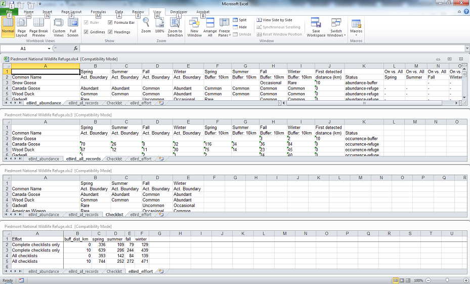
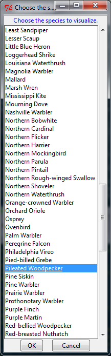
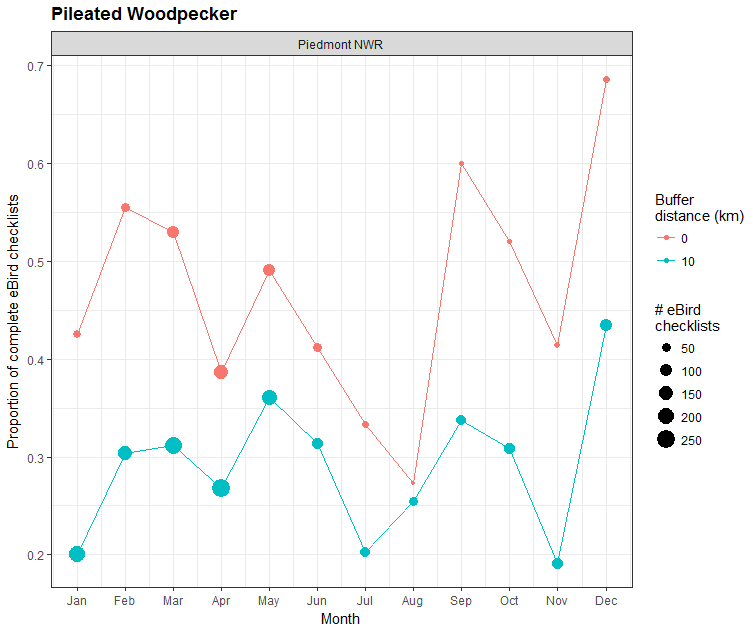

---
output:
#  html_document
  md_document:
    variant: markdown_github
---

```{r, echo = FALSE, message=FALSE}
knitr::opts_chunk$set(
    message=FALSE,
    collapse = TRUE
)

library(geobird)
load("./inst/extdata/piedmont.rda")
```

[](https://travis-ci.org/adamdsmith/geobird)

# USFWS Disclaimer
This United States Fish & Wildlife Service (USFWS) code is provided on an "as is" basis and the user assumes responsibility for its use.  USFWS has relinquished control of the information and no longer has responsibility to protect the integrity , confidentiality, or availability of the information.  Any reference to specific commercial products, processes, or services by service mark, trademark, manufacturer, or otherwise, does not constitute or imply their endorsement, recomendation or favoring by USFWS.  The USFWS seal and logo shall not be used in any manner to imply endorsement of any commercial product or activity by USFWS or the United States Government. 

# The `geobird` package

This package contains functions to read and parse eBird database requests (.txt), store them in a local
SQLite database, and to query that database geographically.  Users may optionally buffer the input geography (i.e., a `SpatialPolygonsDataFrame` object created from an ESRI shapefile) by any distance.  Additionally, functions are available to visualize the monthly phenology of eBird records by species for a given geography and produce a spreadsheet with eBird records by season.  In the latter, seasonal abundance codes are assigned to each species based on the proportion of complete eBird checklists (i.e., observers reported all species observed), provided some minimum number of checklists is present for a given geography and season.  Current functionality is limited to the United States, but there is little to prevent the expansion of the methods to other areas or georeferenced species occurrence databases.

## Installing geobird

The geobird package requires you to have [R](https://www.r-project.org/) (>= 3.2.1) installed on your computer as well as [Rtools](https://cran.r-project.org/bin/windows/Rtools/).  Both will require administrative priveleges but the installation of packages after this initial install will not.

You'll also need the development version of the `data.table` package until version 1.9.8 is released.

With R and Rtools installed, install and load the MABM package to access its functionality:

```
install.packages("devtools") # Only the first time
library("devtools")
install_github("Rdatatable/data.table", build_vignettes = FALSE) # data.table 1.9.7
install_github("adamdsmith/geobird") # Only the first time
library(geobird)
```

## Using geobird

Basic operations are illustrated below.  For details on the arguments and options available in each function, see their associated help files.

### Parsing eBird queries from Cornell

We typically access historical eBird observations by requesting state-by-state queries of the eBird database hosted by Cornell.  It comes as an often large tab-delimited text file (e.g., Florida's weighed in at nearly 4 GB and contained over 10 million records).  We only need a subset of the 43 variables contained in the file and we also wish to exclude records (1) not identified to species, (2) duplicated on eBird checklists of multiple observers, and (3) non-approved (i.e., not yet vetted) records.

The `parse_ebird` function accomplishes these tasks and outputs a data structure amenable to local storage in a SQLite database.  One need only direct the function to the appropriate tab-delimited text file.

Take Georgia, for example.  Parsing leaves us with ~3.3 million (out of more than 4 million) statewide eBird records.

```{r parse, eval = FALSE}
ga_birds <- parse_ebird("../Data/ebd_US-GA_relAug-2015.txt") # 1.5 GB; > 4M records; takes < 1 min
class(ga_birds)
[1] "data.table" "data.frame"
dim(ga_birds)
[1] 3270274      12
```

### Storing it locally for quick access

We store this output locally in a SQLite database.  It's a more convenient format for permanent storage and we can query the entire southeastern eBird database geographically and quickly pass the result from the database to R.  Storing the entire database in local memory is not practicable.

The `store_ebird` function does the trick, although this requires you to have already established a local SQLite database (see example in `help(store_ebird)`).

```{r store, eval=FALSE}
store_ebird(ga_birds)
```

As of version 0.3, you have the option of combining the parsing and storing into a single function call using the `file` argument in `store_ebird`:

```{r store2, eval=FALSE}
store_ebird(file = "../Data/ebd_US-GA_relAug-2015.txt")
```

### Making a geographic query of the database

We currently have the parsed eBird records from all 10 Region 4 (southeast) states stored in the local SQLite database for making geographic queries.  All we need are some polygons defining the areas we wish to query.  In our case, this comes in the form of an ESRI shapefile of southeastern NWRs and fish hatcheries.  

First, we load the shapefile into R:

```{r get_shapefile, eval = FALSE}
SErefuges <- rgdal::readOGR("../GIS", "refuges", verbose = FALSE, stringsAsFactors = FALSE)
```

Now, we have some decisions to make.  Do we want to query all refuges (or a subset) and do we want to extend the area around the boundary (i.e., create a buffer) to capture nearby observations not technically on the refuge?  

Either way, the `geo_ebird` function is our friend.

The main arguments we need to worry with are `query_polys` (the polygons we want to query), `buffers` (the distance(s), in km, we wish to expand our polygon boundary; defaults to 0), and `which_polys` (the identification of specific polygons in `query_polys` if we don't want them all).  For your particular application, you'll likely need to direct the function to the location of the local SQLite database with the `ebird_sqlite` argument and specify the column name in the shapefile that defines the polygons (i.e., the `poly_id` argument).  See `?geo_ebird` for details on these arguments.

For example, we could query the eBird records in all southeastern refuges, with a 2 km buffer around each, using the following command:

```{r all_refuges, eval = FALSE}
all_nwrs <- geo_ebird(SErefuges, buffers = 2)
```

However, we'll take the less time-consuming example of using only a single refuge and no buffer (i.e., use the actual NWR boundary).  In this case, we'll use Piedmont National Wildlife Refuge.

All we need to specify is the file containing the southeastern refuges polygons and select Piedmont NWR using the `which_polys` argument.  This does require you to know what your polygons are called and to specify the name of the column containing that information, but because we built this around our southeastern NWR shapefile, we get to use the defaults.  Lucky us!  Furthermore, all we need is the name of the refuge; we can toss the formality of calling it a "National Wildlife Refuge" or "National Fish Hatchery."

```{r piedmont, eval=FALSE}
piedmont <- geo_ebird(SErefuges, which_polys = "Piedmont")
```

This leaves us with just over 17,500 eBird records (species observations) within the actual boundary of  Piedmont NWR.

We could easily have picked a few refuges as well.  Notice the name is insensitive to capitalization.  Here, for example, we choose to explore eBird records within the actual refuge boundaries and also with an area represented by the refuge and a 10 km buffer.

```{r a_few, eval=FALSE}
a_few_nwrs <- geo_ebird(SErefuges, which_polys = c("Piedmont", "HOBE SoUnD", "CEDar iSLand"),
                        buffer = c(0, 10))
```

### Checklists of species abundance and occurrence

The primary goal of this project was to output, for each refuge, a species list for each refuge and some consistent measure of relative abundance and occurrence.  

The `make_checklists` function generates, for each queried polygon, a spreadsheet of all species detected on at least one eBird checklist. For each season (defined below), an estimated abundance classification (defined below) is provided if a minimum number of complete checklists is available (specified with the `min_lists` argument). Regardless, the total number of checklists (complete and incomplete) on which each species was observed in each season is reported. Likewise, the amount of effort (# of complete and total checklists) is reported by season.

We classified seasons as follows: spring (Mar - May), summer (Jun - Aug), fall (Sep - Nov), and winter (Dec - Feb). This classification corresponds roughly to the seasonal bird checklists present in many NWR brochures (which may have had a small part in the decision to use this classification). 

Abundance designations are classified based on the proportion of complete checklists on which a given species occurs. The `min_lists` argument allows the user to determine the number of checklists necessary to even attempt such a designation. The default is 10 complete checklists, although a larger minimum (e.g., 50 or 100) is probably a more reasonable choice for generating an estimate of species relative abundance. Abundance classifications (% of complete checklists) are: Abundant (A; > 50%), Common (C; (30 - 50%]), Uncommon (U; (20 - 30%]), Occasional (O; (10 - 20%]), Rare (R; (1 - 10%]), and Vagrant (V; <= 1%). Notice that the cutoff for a "Vagrant" designation requires at least 100 checklists; with fewer checklists this designation is lumped with "Rare".

Continuing our Piedmont NWR example, the output of the `make_checklists` function is an Excel spreadsheet containing four sheets: (1) seasonal abundance codes for those season with enough complete checklists, (2) seasonal occurrence information giving the total number of checklists (complete and incomplete) reporting a given species, (3) a finalized checklist within the actual refuge boundary (if the actual boundary was requested) and (4) a summary of the eBird effort at each requested buffer distance (seasonal totals of complete and all eBird checklists).

If no seasons have enough complete checklists to generate abundnace codes, the first and third sheets (seasonal abundance and species checklist) is not generated.  With Piedmont NWR, this is irrelevant as all season contain a sufficient number of complete checklists (as we've defined it; 10 complete checklists).

The columns included on the seasonal abundance and occurrence sheets depend on the specification of the buffer in the call to `geo_ebird`.  In the current example, we did not explore eBird records in a buffer around Piedmont NWR, but rather used only the actual refuge boundary.

Thus, the results include only seasonal abundance classifications, occurrence records, and summaries of eBird effort within the refuge boundaries:

```{r checklist, eval = FALSE}
make_checklists(piedmont)
```

 

If we specify an eBird query within the refuge boundaries (buffer = 0) and within a larger buffered area as well, we are provided some additional occurrence information.  If the buffer is larger than 5 km (buffer >= 5), we are also provided with some additional abundance information.

Take, for example, a comparison of eBird data within Piedmont NWR as well as a 10 km buffer around the refuge:

```{r pied_buff, eval = FALSE}
piedmont_buffs <- geo_ebird(SErefuges, which_polys = "Piedmont", buffers = c(0, 10))
make_checklists(piedmont_buffs)
```

Looking at the top panel below, provided enough complete checklists are available, we are now given (1) abundance codes in each of the distance categories (i.e., actual boundary vs. refuge + 10 km buffer), (2) the distance at which abundance estimates are first possible, (3) a "Status" that indicates whether an abundance classification was possible for at least one season within the refuge ("abundance-refuge") or only by adding the buffer around the refuge ("abundance-buffer"), and (4) a crude season-by-season comparison of relative abundance within the refuge boundary and within the larger area including the buffer.  If the proportion of complete checklists containing a given species was > 25% higher on the refuge compared to the larger, buffered area, it is marked as "on-refuge".  This may indicate that the refuge houses more of a given species compared to the larger landscape (see, e.g., Pileated Woodpecker in fall and winter).  Conversely, an "off-refuge" designation indicates the prevalence of a given species (i.e., proportion of complete checklists) was higher on the larger landscape than on the refuge.  A "-" indicates they're more or less equal.

For the occurrence sheet (second panel from top), we are now given (1) the number of checklists reporting a given species at each distance category, (2) the distance at which occurrence was first documented, and (3) a "Status" that indicates whether it was possible to generate at least one abundance classification ("abundance") or only occurrence.  In the latter case, we distinguish between occurrence within the refuge boundary ("occurrence-refuge") or occurrence only possible by including the buffer around the refuge ("occurrence-buffer").

The checklist (third panel) consolidates the abundance records (top panel) and occurrence only records (from the second panel) into an overall species list for the actual polygon boundary.  Species that occur within the boundary but with inadequate data from an abundance classification are arbitrarily assigned "vagrant" status for their season(s) of occurrence.

Effort is now also summarized for each distance category (bottom panel).

 

### Visualizing records

We can also visualize the monthly patterns of eBird detections by species, relative to eBird effort (i.e., # checklists), using the `plot_ebird_phen` function.

We can specify the species using the `species` argument (using the accepted AOU name but insensitive to capitalization) or, if not specified, we're presented with a list of available species.  We follow up on the possible discrepancy in Pileated Woodpecker abundance on-refuge and on the larger landscape.

```{r phen_plots, eval = FALSE}
plot_ebird_phen(piedmont_buffs)
```

 

 

The plot illustrates the higher proporortion of complete checklists containing Pileated Woodpeckers in fall and winter (Sep - Feb), and also provides information about the amount of monthly effort which, for Piedmont and the surrounding area, is greatest from February through June.
